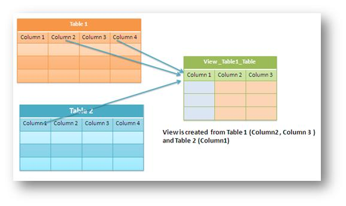
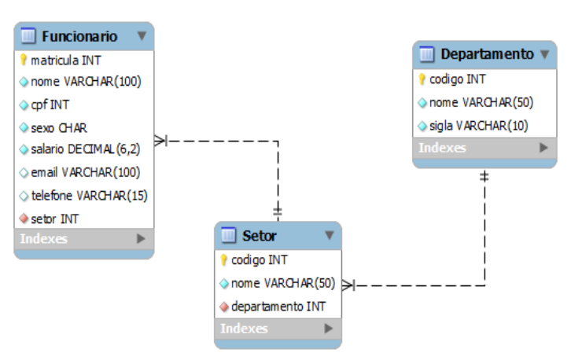
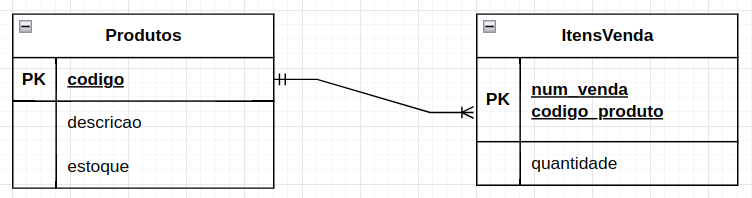

# O que é uma View?


 - "tabelas virtuais" atualizáveis (INSERT, UPDATE e DELETE)
 - criadas com base em consultas
 -  "janela" a partir da qual se pode visualizar e alterar os campos virtuais selecionados



---

# Vantagens das Views
 - Segurança:
    - restringir informação a certos grupos de utilizadores.
 - Conveniência:
    - substituir uma consulta complexa por uma View, que é usada de uma forma mais simplificada.

---

# Criação de Views
```sql
CREATE VIEW [View_Name] 
AS
[SELECT_Statement]
```


```sql
CREATE VIEW SampleView
As
SELECT EmpID, EmpName  FROM EmpInfo
```

---
# Exemplo



---
#### Nome de todos os funcionário do setor 2
```sql
CREATE OR REPLACE VIEW vw_teste (nome_funcionario)
AS SELECT nome FROM funcionario WHERE setor = 2
```


#### Nome dos funcionários e sigla do departamento com código = 2
```sql
CREATE OR REPLACE VIEW vw_adm (funcionario,departamento)
AS 
SELECT f.nome, d.sigla 
FROM funcionario f
INNER JOIN setor s ON f.setor = s.codigo
INNER JOIN departamento d ON s.departamento = d.codigo
WHERE d.codigo = 2

```

---
# Triggers

Um Trigger (ou gatilho) é um objeto de BD, associado a uma tabela, definido para ser executado (disparado) em resposta a um evento em particular.

### Eventos:
 - INSERT
 - UPDATE
 - DELETE

---
# Execução de um Trigger
#### Tempo de disparo:
- Triggers podem ser disparados antes (BEFORE) ou depois (AFTER) de um evento.

#### Quantidade:
 - É possível definir inúmeros Triggers em um BD, mas, para cada um dos eventos (de uma tabela) é possível definir apenas um Trigger antes e um depois.

---
# Registros NEW e OLD
#### NEW e OLD:
 - Palavras reservadas para acesso aos registros que serão
incluídos (NEW) ou removidos (OLD).
#### Inserção de registros (INSERT):
 - A palavra reservada NEW dá acesso ao novo registro.

#### Exclusão de registros (DELETE):
 - A palavra reservada OLD dá acesso ao registro que será excluído.
#### Atualização de registros (UPDATE):
 - Podem ser usadas tanto o NEW (novos) quanto o OLD
(antigos) para acessar os registros.

---

# Criação de Triggers

```sql
CREATE TRIGGER nome tempo_disparo evento
ON tabela FOR EACH ROW código
```

tempo_disparo: BEFORE / AFTER
evento: INSERT / UPDATE / DELETE

---

# Criação de Triggers

```sql
CREATE TRIGGER nome tempo_disparo evento
ON tabela FOR EACH ROW código
```

tempo_disparo: BEFORE / AFTER
evento: INSERT / UPDATE / DELETE

```sql
CREATE TRIGGER atualizar_data_modificacao
BEFORE INSERT ON tabela_exemplo
FOR EACH ROW
SET NEW.data_modificacao = NOW()
```
 - um dado está chegando no DB, mas não possui a data de modificação
 - NEW -> represente um objeto com as infos novas
 - antes de ser inserido (BEFORE INSERT) a data de modificaço está sendo preenchida com datetime atual (NOW)
 - inserção segue normalmente

---


Ao  inserir ou remover registros da tabela ItensVenda, o estoque do produto deve ser alterado na tabela Produtos

Triggers:
 - AFTER INSERT: efetuar baixa no estoque;
 - AFTER DELETE: realizar devolução da quantidade do produto ao estoque.

---

### AFTER INSERT: efetuar baixa no estoque;
```sql
CREATE TRIGGER Tgr_ItensVenda_Insert
AFTER INSERT ON ItensVenda FOR EACH ROW
UPDATE Produtos SET estoque = estoque - NEW.quantidade
WHERE codigo = NEW.codigo_produto;
```
---

### AFTER DELETE: realizar devolução da quantidade do produto ao estoque.
```sql
CREATE TRIGGER Tgr_ItensVenda_Delete
AFTER DELETE ON ItensVenda FOR EACH ROW
UPDATE Produtos SET estoque = estoque + OLD.quantidade
WHERE codigo = OLD.codigo_produto;
```

---
#### Usando o do BD World Population do Datawars:
1. Criar View para exibr todas as cidades com uma população superior a 1 milhão, juntamente com o nome do país.

2. Criar View que exiba o nome e a população dos países com mais de 50 milhões de habitantes.

3. mostre o nome da cidade, o nome do país e a população de todas as cidades, ordenando pelos países.

4. Criar uma Trigger que impeça a inserção de uma nova cidade com uma população negativa (lance uma exceção)

5. Crie um trigger que registre todas as atualizações feitas na tabela country em uma tabela de auditoria chamada country_audit.
